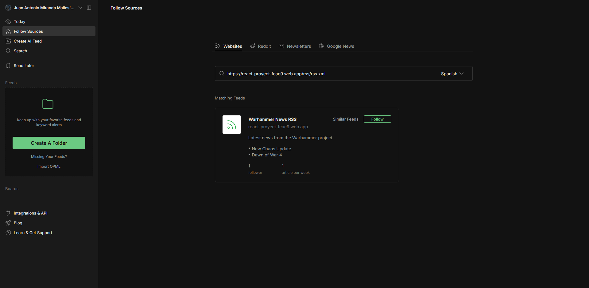
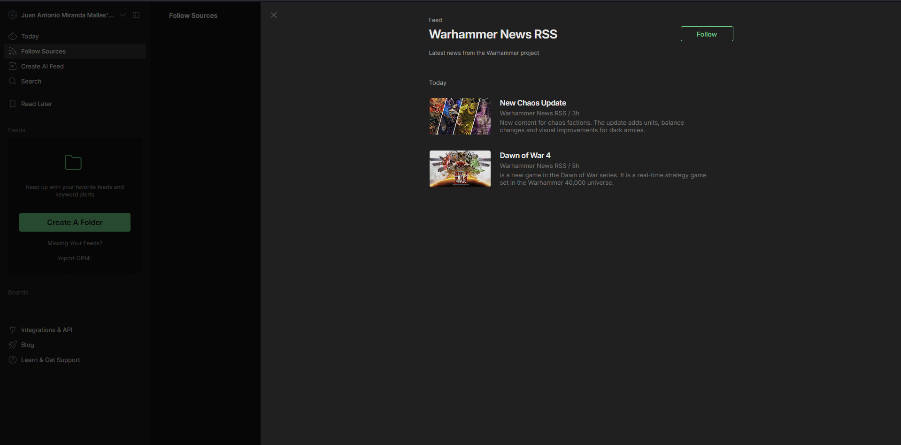

# React Warhammer 40K Project

> **UT5 – Import / Export XML, CSV and JSON with Firebase**

---

## Project Description

This project is a single-page application (SPA) built with **React + Vite** dedicated to Warhammer 40,000 enthusiasts. It features dynamic content about factions, an image gallery, a products catalogue, and a full CRUD for Warhammer planets stored in **Firebase Firestore**. Starting from UT5 the planets CRUD also supports importing and exporting data in **JSON, CSV and XML** formats.

---

## Live Demo

[https://react-proyect-fcac9.web.app](https://react-proyect-fcac9.web.app)

---

## Technologies Used

| Technology | Purpose |
|---|---|
| **React 18** | UI library |
| **Vite** | Dev server & bundler |
| **Firebase Firestore** | Cloud database |
| **React Router DOM v6** | Client-side routing |
| **i18next** | Internationalisation (EN / ES) |

---

## Installation

```bash
# 1. Clone the repository
git clone https://github.com/JuanAntonioMMalles/React-Proyect-Warhammer40k.git
cd React-Proyect-Warhammer40k

# 2. Install dependencies
npm install

# 3. Start the development server
npm run dev
```

The application will be available at `http://localhost:5173`.

### Production build

```bash
npm run build
npm run preview
```

### Deploy to Firebase Hosting

```bash
npm run build
firebase deploy
```

---

## Project Structure

```
src/
├── firebase/
│   └── firebase.js          # Firebase initialisation (app + db)
├── services/
│   └── planetsService.js    # ✅ Centralised Firebase access layer
├── sections/
│   └── PlanetsCrud.jsx      # Planets CRUD with import/export UI
├── components/              # Header, Footer, Layout, Notification…
├── contexts/                # ProductsContext (localStorage)
├── hooks/                   # useLocalStorage, useClickOutside
├── pages/                   # Route-level page components
└── style.css
```

### Services layer (`src/services/`)

All Firebase Firestore calls for the **planets** collection are centralised in `planetsService.js`. Components never import `db` directly – they call service functions:

| Function | Description |
|---|---|
| `getPlanets()` | Fetch all planet documents |
| `addPlanet(data)` | Create a new document |
| `updatePlanet(id, data)` | Update an existing document |
| `deletePlanet(id)` | Delete a document |
| `importPlanets(array)` | Batch-write multiple planets |

---

## Import / Export Feature

On the **Planets** page you will find an **Import / Export toolbar** that lets you:

### Export
- **⬇ JSON** → downloads `datos.json`
- **⬇ CSV** → downloads `datos.csv`
- **⬇ XML** → downloads `datos.xml`

All exported files contain exactly the planets currently stored in Firebase.

### Import
Click **📂 Choose file** and select a `.json`, `.csv` or `.xml` file. Each record is validated and written to Firestore via a batch write.

Expected fields per planet:

| Field | Type | Required |
|---|---|---|
| `name` | string | ✅ |
| `sector` | string | ✅ |
| `category` | `imperium` \| `xenos` \| `chaos` \| `dead` | ✅ |
| `description` | string | ✅ |
| `image` | string (URL) | optional |

---

## Sample Import Files

Download these files and import them directly into the app:

| Format | Link |
|---|---|
| JSON | [datos.json](public/sample-data/datos.json) |
| CSV | [datos.csv](public/sample-data/datos.csv) |
| XML | [datos.xml](public/sample-data/datos.xml) |

Each file contains **5 example Warhammer planets** ready to be imported.

---

## Git Branches

```
main
└── develop
    └── feature/import-and-export   ← new branch for this feature
```

Branch workflow:
1. Feature developed on `feature/import-and-export`
2. Merged into `develop`
3. Merged into `main` and deployed

---

## Screenshots




---

## Author

- **Name:** Juan Antonio Miranda Malles
